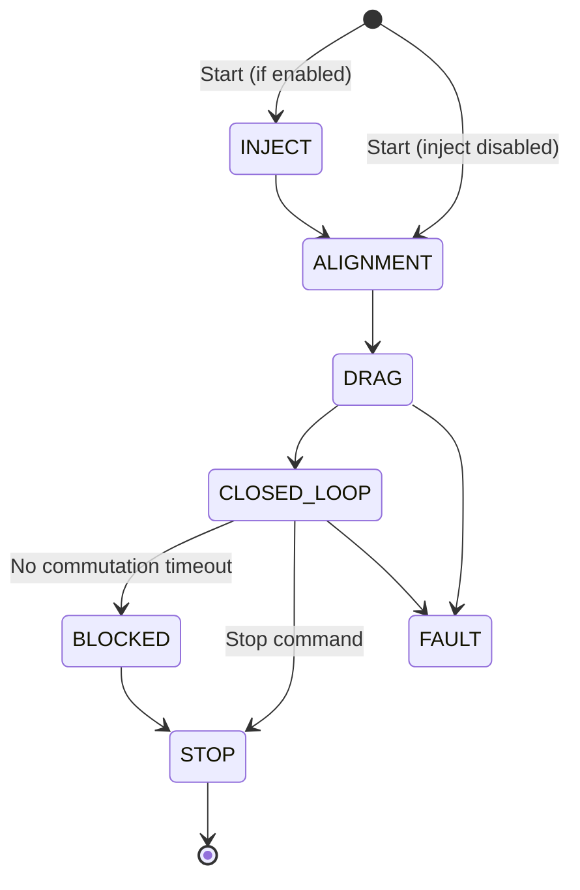

Brushless DC (BLDC) motors offer better speed-torque characteristics, high efficiency, long lifespan, and a wide speed range compared with brushed motors. ESP-IoT-Solution provides three components for BLDC motor control:

<CardGroup cols={3}>
  <Card title="esp_sensorless_bldc_control" icon="rotate" href="#sensorless-bldc-control">
    Six-step sensorless square wave control using back-EMF zero-crossing detection.
  </Card>
  <Card title="esp_simplefoc" icon="wave-sine" href="#foc-field-oriented-control">
    Field-Oriented Control (FOC) for smooth torque, speed, and position control.
  </Card>
  <Card title="drv10987" icon="microchip" href="#drv10987-brushless-motor-driver">
    Driver for the TI DRV10987 sensorless 180° sinusoidal motor driver IC.
  </Card>
</CardGroup>

---

## Sensorless BLDC control

The `esp_sensorless_bldc_control` component is a sensorless BLDC square wave control library for ESP32 series chips. It drives three-phase motors through a six-step commutation sequence and detects the rotor position from back-EMF zero-crossing points — no Hall sensors required.

### Features

- Zero-crossing detection via ADC sampling (requires MCPWM)
- Zero-crossing detection via hardware comparators
- Rotor initial phase detection using pulse injection
- Stall protection
- Closed-loop speed control with PID

### How six-step commutation works

A six-MOSFET inverter bridge drives the three motor phases (U, V, W). In each of six steps, two bridge arms conduct simultaneously — one upper arm and one lower arm — while the third phase floats. Sequencing through all six steps produces a rotating magnetic field that spins the rotor.

| Upper arm | Lower arm | Phase A | Phase B | Phase C |
|-----------|-----------|---------|---------|---------|
| UH | WL | DC+ | Floating | DC− |
| UH | VL | DC+ | DC− | Floating |
| WH | VL | Floating | DC− | DC+ |
| WH | UL | DC− | Floating | DC+ |
| VH | UL | DC− | DC+ | Floating |
| VH | WL | Floating | DC+ | DC− |

<Warning>
The upper and lower bridge arms of the same phase must never conduct simultaneously. Always configure dead time to prevent shoot-through.
</Warning>

### Back-EMF and zero-crossing detection

When the motor rotates, each winding generates a back-EMF proportional to rotor speed:

```
BEMF = N · l · r · B · ω
```

The rotor's six positions within one electrical cycle are identified by detecting zero-crossing points of the back-EMF in the non-conducting (floating) phase. A zero-crossing delayed by 30° electrical degrees marks the commutation point.

<Tabs>
  <Tab title="ADC sampling">
    The floating phase-to-ground voltage and DC bus voltage are sampled simultaneously via ADC. A zero-crossing event occurs when the terminal voltage equals half the DC bus voltage.

    ADC sampling must occur while the upper MOSFET is conducting. Configure MCPWM in rising-and-falling mode and trigger ADC at the counter peak to capture the correct instant.

    <Note>
      ADC zero-crossing detection requires MCPWM as the PWM driver. LEDC does not support the necessary callback timing.
    </Note>
  </Tab>
  <Tab title="Hardware comparator">
    The three phase terminals are connected through equal-value resistors to reconstruct a virtual neutral point. A hardware comparator compares each phase's back-EMF against this neutral point and outputs a zero-crossing signal on a GPIO pin.

    Because noise is common in practice, multiple consecutive detections are required before a zero-crossing is accepted as valid — controlled by `ZERO_CROSS_DETECTION_ACCURACY`.
  </Tab>
</Tabs>

### Control state machine

The sensorless control sequence moves through the following states:



<AccordionGroup>
  <Accordion title="INJECT — initial phase detection">
    High-frequency voltage pulses are injected sequentially into all six phase combinations. The bus current is sampled via ADC on a sensing resistor for each injection. The maximum current identifies the initial rotor position interval.

    Requires `INJECT_ENABLE = 1` and MCPWM driver mode. Key parameters:

    - `INJECT_DUTY` — injected duty cycle (typically high, e.g. `PWM_DUTYCYCLE_90`)
    - `CHARGE_TIME` — inductance charging and injection duration in PWM periods
  </Accordion>
  <Accordion title="ALIGNMENT — rotor locking">
    A specific winding pair is energized for a fixed duration to lock the rotor at a known phase before forced commutation begins.

    - `ALIGNMENTNMS` — alignment duration in milliseconds (too short: misalignment; too long: overcurrent)
    - `ALIGNMENTDUTY` — alignment torque duty cycle
  </Accordion>
  <Accordion title="DRAG — forced commutation ramp">
    The rotor is accelerated by stepping through all six commutation states with increasing speed and voltage. The duty cycle and step delay are ramped from start values to end values.

    - `RAMP_TIM_STA` — initial step delay (µs)
    - `RAMP_TIM_END` — minimum step delay (µs)
    - `RAMP_TIM_STEP` — step decrement per iteration
    - `RAMP_DUTY_STA` — starting duty cycle
    - `RAMP_DUTY_END` — maximum duty cycle during drag
    - `RAMP_DUTY_INC` — duty cycle increment per step

    <Warning>
      Drag parameters must be tuned under actual load. No-load parameters may not work under load.
    </Warning>
  </Accordion>
  <Accordion title="CLOSED_LOOP — back-EMF control">
    After sufficient drag speed is reached, the controller switches to sensorless closed-loop mode. Zero-crossing events drive commutation timing.

    **ADC parameters:**
    - `ENTER_CLOSE_TIME` — delay count before entering closed loop after drag
    - `ZERO_REPEAT_TIME` — number of consecutive zero-crossings required for a valid detection
    - `AVOID_CONTINUE_CURRENT_TIME` — delay after commutation to avoid freewheeling current noise

    **Comparator parameters:**
    - `ZERO_STABLE_FLAG_CNT` — stable revolution count before entering sensorless mode
    - `ZERO_CROSS_DETECTION_ACCURACY` — consecutive matching samples required (e.g. `0xFFFF` = 16 times)

    **Advance commutation:**
    - `ZERO_CROSS_ADVANCE` — commutation advance divisor; advance angle = 180° ÷ `ZERO_CROSS_ADVANCE` (minimum 6)
  </Accordion>
</AccordionGroup>

### Adding the component

<Steps>
  <Step title="Add the dependency">
    ```bash
    idf.py add-dependency "espressif/esp_sensorless_bldc_control=*"
    ```
  </Step>
  <Step title="Copy the user configuration file">
    Copy `components/esp_sensorless_bldc_control/user_cfg/bldc_user_cfg.h` into your project's `main/` directory. This file controls all motor tuning parameters and must be present at compile time.
  </Step>
  <Step title="Link the config file in CMakeLists.txt">
    Add the following to your `main/CMakeLists.txt`:

    ```cmake
    idf_component_get_property(bldc_lib espressif__esp_sensorless_bldc_control COMPONENT_LIB)
    cmake_policy(SET CMP0079 NEW)
    target_link_libraries(${bldc_lib} PUBLIC ${COMPONENT_LIB})
    ```
  </Step>
</Steps>

### Configuration parameters

Edit `bldc_user_cfg.h` to match your motor and hardware.

<AccordionGroup>
  <Accordion title="PWM driver settings">

    | Macro | Default | Description |
    |-------|---------|-------------|
    | `PWM_MODE` | `BLDC_MCPWM` | PWM peripheral: `BLDC_MCPWM` or `BLDC_LEDC` |
    | `MCPWM_CLK_SRC` | `20000000` | MCPWM clock source frequency (Hz) |
    | `MCPWM_PERIOD` | `2000` | MCPWM counter period (ticks) |
    | `FREQ_HZ` | `10000` | LEDC frequency (Hz) |
    | `DUTY_RES` | `11` | LEDC duty resolution (bits) |

  </Accordion>
  <Accordion title="Motor parameters">

    | Macro | Default | Description |
    |-------|---------|-------------|
    | `POLE_PAIR` | `5` | Number of motor pole pairs |
    | `BASE_VOLTAGE` | `12` | Rated voltage (V) |
    | `BASE_SPEED` | `1000` | Rated speed (RPM) |

  </Accordion>
  <Accordion title="Speed PID parameters">

    | Macro | Default | Description |
    |-------|---------|-------------|
    | `SPEED_KP` | `0.004` | Proportional gain |
    | `SPEED_KI` | `0.00015` | Integral gain |
    | `SPEED_KD` | `0` | Derivative gain |
    | `SPEED_MIN_OUTPUT` | `PWM_DUTYCYCLE_10` | Minimum PID output duty |
    | `SPEED_MAX_OUTPUT` | `DUTY_MAX` | Maximum PID output duty |
    | `SPEED_CAL_TYPE` | `0` | PID type: `0` = incremental, `1` = positional |
    | `SPEED_MAX_RPM` | `1000` | Maximum speed (RPM) |
    | `SPEED_MIN_RPM` | `0` | Minimum speed (RPM) |
    | `MAX_SPEED_MEASUREMENT_FACTOR` | `1.2` | Erroneous speed rejection threshold (× `SPEED_MAX_RPM`) |

  </Accordion>
</AccordionGroup>

### API reference

#### `bldc_control_init`

```c
esp_err_t bldc_control_init(bldc_control_handle_t *handle, bldc_control_config_t *config);
```

Initialize the BLDC controller.

<ParamField path="handle" type="bldc_control_handle_t *" required>
  Pointer to a handle variable. Set to a valid handle on success.
</ParamField>
<ParamField path="config" type="bldc_control_config_t *" required>
  Pointer to the control configuration structure.
</ParamField>

Returns `ESP_OK` on success, `ESP_ERR_INVALID_ARG` if either argument is NULL, `ESP_ERR_NO_MEM` if allocation fails.

---

#### `bldc_control_deinit`

```c
esp_err_t bldc_control_deinit(bldc_control_handle_t *handle);
```

Release all resources associated with the BLDC controller.

<ParamField path="handle" type="bldc_control_handle_t *" required>
  Pointer to the handle returned by `bldc_control_init`.
</ParamField>

---

#### `bldc_control_start`

```c
esp_err_t bldc_control_start(bldc_control_handle_t *handle, uint32_t expect_speed_rpm);
```

Start the motor.

<ParamField path="handle" type="bldc_control_handle_t *" required>
  Pointer to the BLDC control handle.
</ParamField>
<ParamField path="expect_speed_rpm" type="uint32_t" required>
  Target speed in RPM. Ignored in open-loop speed mode.
</ParamField>

---

#### `bldc_control_stop`

```c
esp_err_t bldc_control_stop(bldc_control_handle_t *handle);
```

Stop the motor.

---

#### `bldc_control_set_dir`

```c
esp_err_t bldc_control_set_dir(bldc_control_handle_t *handle, dir_enum_t dir);
```

Set the motor rotation direction.

<ParamField path="handle" type="bldc_control_handle_t *" required>
  Pointer to the BLDC control handle.
</ParamField>
<ParamField path="dir" type="dir_enum_t" required>
  Direction value: `CW` (clockwise) or `CCW` (counter-clockwise).
</ParamField>

---

#### `bldc_control_get_dir`

```c
dir_enum_t bldc_control_get_dir(bldc_control_handle_t *handle);
```

Returns the current motor direction.

---

#### `bldc_control_set_duty`

```c
esp_err_t bldc_control_set_duty(bldc_control_handle_t *handle, uint16_t duty);
```

Set the PWM duty cycle directly. Use only in open-loop speed mode; not effective in closed-loop.

<ParamField path="duty" type="uint16_t" required>
  PWM duty value from `0` to `DUTY_MAX`.
</ParamField>

---

#### `bldc_control_get_duty`

```c
int bldc_control_get_duty(bldc_control_handle_t *handle);
```

Returns the current PWM duty cycle.

---

#### `bldc_control_set_speed_rpm`

```c
esp_err_t bldc_control_set_speed_rpm(bldc_control_handle_t *handle, int speed_rpm);
```

Set the target speed in RPM. Effective in closed-loop speed mode.

---

#### `bldc_control_get_speed_rpm`

```c
int bldc_control_get_speed_rpm(bldc_control_handle_t *handle);
```

Returns the current measured speed in RPM.

### Code example

```c
#include "bldc_control.h"

static bldc_control_handle_t bldc_control_handle = NULL;

static void bldc_control_event_handler(void *arg, esp_event_base_t event_base,
                                       int32_t event_id, void *event_data)
{
    switch (event_id) {
        case BLDC_CONTROL_CLOSED_LOOP:
            // Motor has entered closed-loop control
            break;
        case BLDC_CONTROL_BLOCKED:
            // Motor stall detected
            bldc_control_stop(&bldc_control_handle);
            break;
        default:
            break;
    }
}

void app_main(void)
{
    esp_event_loop_create_default();
    esp_event_handler_register(BLDC_CONTROL_EVENT, ESP_EVENT_ANY_ID,
                                &bldc_control_event_handler, NULL);

    // Configure upper-arm PWM switches (MCPWM)
    switch_config_t upper_switch_config = {
        .control_type = CONTROL_TYPE_MCPWM,
        .bldc_mcpwm = {
            .group_id = 0,
            .gpio_num = {17, 16, 15},
        },
    };

    // Configure lower-arm switches (GPIO)
    switch_config_t lower_switch_config = {
        .control_type = CONTROL_TYPE_GPIO,
        .bldc_gpio[0] = { .gpio_num = 12, .gpio_mode = GPIO_MODE_OUTPUT },
        .bldc_gpio[1] = { .gpio_num = 11, .gpio_mode = GPIO_MODE_OUTPUT },
        .bldc_gpio[2] = { .gpio_num = 10, .gpio_mode = GPIO_MODE_OUTPUT },
    };

    // Configure ADC zero-crossing detection
    bldc_zero_cross_adc_config_t zero_cross_adc_config = {
        .adc_handle = NULL,
        .adc_unit = ADC_UNIT_1,
        .chan_cfg = {
            .bitwidth = ADC_BITWIDTH_12,
            .atten = ADC_ATTEN_DB_0,
        },
        .adc_channel = {ADC_CHANNEL_3, ADC_CHANNEL_4, ADC_CHANNEL_5,
                        ADC_CHANNEL_0, ADC_CHANNEL_1},
    };

    bldc_control_config_t config = {
        .speed_mode = SPEED_CLOSED_LOOP,
        .control_mode = BLDC_SIX_STEP,
        .alignment_mode = ALIGNMENT_ADC,
        .six_step_config = {
            .lower_switch_active_level = 0,
            .upper_switch_config = upper_switch_config,
            .lower_switch_config = lower_switch_config,
            .mos_en_config.has_enable = false,
        },
        .zero_cross_adc_config = zero_cross_adc_config,
    };

    bldc_control_init(&bldc_control_handle, &config);
    bldc_control_set_dir(bldc_control_handle, CCW);
    bldc_control_start(bldc_control_handle, 300);
}
```

---

## FOC (Field-Oriented Control)

`esp_simplefoc` is an FOC component based on [Arduino-FOC](https://github.com/simplefoc/Arduino-FOC), adapted for ESP chips that support LEDC and MCPWM peripherals. FOC produces smooth, efficient torque by aligning the stator current vector with the rotor flux, enabling precise speed, torque, and position control.

### Features

- Voltage control mode
- Compatible with Arduino-FOC control routines
- Configuration via [SimpleFOCStudio](https://github.com/simplefoc/SimpleFOCStudio)
- IQMath acceleration for FOC computation
- Up to four simultaneous brushless motor instances
- Supports AS5600 (I2C), MT6701 (I2C/SPI), and AS5048A (SPI) angle sensors

### Adding the component

<Steps>
  <Step title="Add the dependency">
    ```bash
    idf.py add-dependency "espressif/esp_simplefoc"
    ```
  </Step>
  <Step title="Set FreeRTOS tick rate to 1000 Hz">
    Open `idf.py menuconfig` and navigate to:

    **Component config → FreeRTOS → Kernel → configTICK_RATE_HZ**

    Set the value to `1000`. The default value of `100` causes motor exceptions in FOC mode.
  </Step>
  <Step title="Configure motor and driver parameters">
    See the configuration section below.
  </Step>
  <Step title="Build and flash">
    ```bash
    idf.py build flash
    ```
  </Step>
</Steps>

### Configuration

<AccordionGroup>
  <Accordion title="Motor parameters">
    Create a `BLDCMotor` object with the pole pair count for your motor:

    ```cpp
    // 14 pole-pair motor
    BLDCMotor motor = BLDCMotor(14);
    ```

    Optional parameters (set to `NOT_SET` to skip):
    - `R` — phase resistance (Ω)
    - `KV` — motor KV rating (RPM/V)
    - `L` — phase inductance (H)
  </Accordion>
  <Accordion title="MOSFET driver (3PWM mode)">
    ```cpp
    // PWM pins for phases U, V, W
    BLDCDriver3PWM driver = BLDCDriver3PWM(4, 5, 6);
    driver.voltage_power_supply = 12;  // Supply voltage (V)
    driver.voltage_limit = 11;         // Output voltage limit (V)
    driver.init({1, 2, 3});            // MCPWM group assignments
    motor.linkDriver(&driver);
    ```
  </Accordion>
  <Accordion title="Angle sensor">
    Initialize and link the angle sensor before calling `motor.init()`:

    ```cpp
    // AS5600 via I2C
    AS5600 as5600 = AS5600(I2C_NUM_0, GPIO_NUM_1, GPIO_NUM_2);
    as5600.init();
    motor.linkSensor(&as5600);
    ```

    Supported sensors: `AS5048A` (SPI), `MT6701` (I2C/SPI), `AS5600` (I2C).
  </Accordion>
  <Accordion title="Control mode">
    Select a control mode before calling `motor.init()`:

    | Mode | Description |
    |------|-------------|
    | `torque` | Torque control |
    | `velocity` | Closed-loop speed control |
    | `angle` | Closed-loop position control |
    | `velocity_openloop` | Open-loop speed control |
    | `angle_openloop` | Open-loop angle control |

    <Tip>
      Use open-loop control during hardware bring-up for quick validation before tuning closed-loop parameters.
    </Tip>
  </Accordion>
</AccordionGroup>

### Code example

```cpp
#include "esp_simplefoc.h"

BLDCMotor motor = BLDCMotor(14);
BLDCDriver3PWM driver = BLDCDriver3PWM(4, 5, 6);
AS5600 as5600 = AS5600(I2C_NUM_0, GPIO_NUM_1, GPIO_NUM_2);
Commander command = Commander(Serial);

float target_velocity = 0;

void doTarget(char *cmd) { command.scalar(&target_velocity, cmd); }

extern "C" void app_main(void)
{
    // Angle sensor
    as5600.init();
    motor.linkSensor(&as5600);

    // Driver
    driver.voltage_power_supply = 12;
    driver.voltage_limit = 11;
    driver.init({1, 2, 3});
    motor.linkDriver(&driver);

    // Control mode
    motor.controller = MotionControlType::velocity;

    // Initialize
    motor.init();
    motor.initFOC();

    command.add('T', doTarget, "target velocity");

    while (1) {
        motor.loopFOC();
        motor.move(target_velocity);
        command.run();
    }
}
```

<Note>
  If `initFOC` reports a pole pair mismatch, verify the motor pole pair count and minimize the gap between the magnetic ring encoder and the angle sensor.
</Note>

---

## DRV10987 brushless motor driver

The TI DRV10987 is a 3-phase sensorless 180° sinusoidal motor driver with integrated power MOSFETs providing up to 2 A continuous drive current. It is configured over I2C and stores its configuration in on-chip EEPROM.

The `drv10987` component provides a simplified C API for the full EEPROM programming and motor control sequence.

### Hardware connections

| DRV10987 pin | ESP32 GPIO | Function |
|---|---|---|
| SDA | GPIO 23 | I2C data |
| SCL | GPIO 22 | I2C clock |
| DIR | GPIO 21 | Rotation direction |

Default I2C address: `0x52` (`DRV10987_I2C_ADDRESS_DEFAULT`)

### Adding the component

```bash
idf.py add-dependency "espressif/drv10987"
```

### API reference

#### `drv10987_create`

```c
esp_err_t drv10987_create(drv10987_handle_t *handle, drv10987_config_t *config);
```

Create and initialize a DRV10987 device instance.

<ParamField path="handle" type="drv10987_handle_t *" required>
  Pointer to a handle variable that receives the device handle on success.
</ParamField>
<ParamField path="config" type="drv10987_config_t *" required>
  Pointer to configuration containing the I2C bus handle, device address, and direction GPIO pin.
</ParamField>

---

#### `drv10987_delete`

```c
esp_err_t drv10987_delete(drv10987_handle_t handle);
```

Deinitialize the device and free all allocated memory.

---

#### `drv10987_enable_control`

```c
esp_err_t drv10987_enable_control(drv10987_handle_t handle);
```

Enable the motor driver output (sets `MTR_DIS = 0`).

---

#### `drv10987_disable_control`

```c
esp_err_t drv10987_disable_control(drv10987_handle_t handle);
```

Disable the motor driver output (sets `MTR_DIS = 1`). Call this before writing to EEPROM.

---

#### `drv10987_write_speed`

```c
esp_err_t drv10987_write_speed(drv10987_handle_t handle, uint16_t speed);
```

Write a target speed command to the device.

<ParamField path="speed" type="uint16_t" required>
  9-bit speed value. Maximum is `511`.
</ParamField>

---

#### `drv10987_set_direction_uvw`

```c
esp_err_t drv10987_set_direction_uvw(drv10987_handle_t handle);
```

Set motor direction to UVW phase sequence.

---

#### `drv10987_set_direction_uwv`

```c
esp_err_t drv10987_set_direction_uwv(drv10987_handle_t handle);
```

Set motor direction to UWV phase sequence (reverse rotation).

---

#### `drv10987_write_access_to_eeprom`

```c
esp_err_t drv10987_write_access_to_eeprom(drv10987_handle_t handle, uint8_t maximum_failure_count);
```

Enable EEPROM access by writing the access code (`0xC0DE`) to register `0x31`. Retries up to `maximum_failure_count` times if unsuccessful.

---

#### `drv10987_mass_write_acess_to_eeprom`

```c
esp_err_t drv10987_mass_write_acess_to_eeprom(drv10987_handle_t handle);
```

Trigger a mass write, programming all shadow registers into EEPROM.

---

#### `drv10987_write_config_register`

```c
esp_err_t drv10987_write_config_register(drv10987_handle_t handle,
                                          drv10987_config_register_addr_t config_register_addr,
                                          void *config);
```

Write a single configuration register to the device shadow registers.

<ParamField path="config_register_addr" type="drv10987_config_register_addr_t" required>
  Register address constant, e.g. `CONFIG1_REGISTER_ADDR` through `CONFIG7_REGISTER_ADDR`.
</ParamField>
<ParamField path="config" type="void *" required>
  Pointer to the configuration struct for the selected register (e.g. `drv10987_config1_t *`).
</ParamField>

---

#### `drv10987_read_config_register`

```c
drv10987_config_reg_t drv10987_read_config_register(drv10987_handle_t handle);
```

Read and return the values of all configuration registers.

---

#### `drv10987_read_eeprom_status`

```c
drv10987_eeprom_status_t drv10987_read_eeprom_status(drv10987_handle_t handle);
```

Returns `EEPROM_READY` when the EEPROM is available for read/write, or `EEPROM_NO_READY` otherwise.

---

#### `drv10987_read_driver_status`

```c
esp_err_t drv10987_read_driver_status(drv10987_handle_t handle, drv10987_fault_t *fault);
```

Read the driver status register into a fault structure.

---

#### `drv10987_read_phase_resistance_and_kt`

```c
esp_err_t drv10987_read_phase_resistance_and_kt(drv10987_handle_t handle,
                                                  float *phase_res, float *kt);
```

Read the motor phase resistance (Ω) and back-EMF constant (Kt) from the device.

---

#### `drv10987_clear_driver_fault`

```c
esp_err_t drv10987_clear_driver_fault(drv10987_handle_t handle);
```

Clear all latched driver faults.

### Code example

```c
#include "drv10987.h"
#include "i2c_bus.h"

#define I2C_MASTER_SDA_IO   23
#define I2C_MASTER_SCL_IO   22
#define I2C_MASTER_NUM      I2C_NUM_0
#define I2C_MASTER_FREQ_HZ  100000
#define DIRECTION_IO        21
#define MOTOR_SPEED         200

static i2c_bus_handle_t i2c_bus = NULL;
static drv10987_handle_t drv10987 = NULL;

void app_main(void)
{
    // Step 1: Initialize the I2C bus
    i2c_config_t conf = {
        .mode = I2C_MODE_MASTER,
        .sda_io_num = I2C_MASTER_SDA_IO,
        .sda_pullup_en = GPIO_PULLUP_ENABLE,
        .scl_io_num = I2C_MASTER_SCL_IO,
        .scl_pullup_en = GPIO_PULLUP_ENABLE,
        .master.clk_speed = I2C_MASTER_FREQ_HZ,
    };
    i2c_bus = i2c_bus_create(I2C_MASTER_NUM, &conf);

    // Step 2: Create the DRV10987 device
    drv10987_config_t drv10987_cfg = {
        .bus = i2c_bus,
        .dev_addr = DRV10987_I2C_ADDRESS_DEFAULT,
        .dir_pin = DIRECTION_IO,
    };
    drv10987_create(&drv10987, &drv10987_cfg);

    // Step 3: Set motor rotation direction
    drv10987_set_direction_uvw(drv10987);

    // Step 4: Unlock EEPROM access
    drv10987_write_access_to_eeprom(drv10987, 5);

    // Step 5: Write configuration registers
    // Adjust Rm and Kt in config1/config2 for your specific motor
    drv10987_config1_t config1 = DEFAULT_DRV10987_CONFIG1;
    drv10987_write_config_register(drv10987, CONFIG1_REGISTER_ADDR, &config1);

    drv10987_config2_t config2 = DEFAULT_DRV10987_CONFIG2;
    drv10987_write_config_register(drv10987, CONFIG2_REGISTER_ADDR, &config2);

    drv10987_config3_t config3 = DEFAULT_DRV10987_CONFIG3;
    drv10987_write_config_register(drv10987, CONFIG3_REGISTER_ADDR, &config3);

    drv10987_config4_t config4 = DEFAULT_DRV10987_CONFIG4;
    drv10987_write_config_register(drv10987, CONFIG4_REGISTER_ADDR, &config4);

    drv10987_config5_t config5 = DEFAULT_DRV10987_CONFIG5;
    drv10987_write_config_register(drv10987, CONFIG5_REGISTER_ADDR, &config5);

    drv10987_config6_t config6 = DEFAULT_DRV10987_CONFIG6;
    drv10987_write_config_register(drv10987, CONFIG6_REGISTER_ADDR, &config6);

    drv10987_config7_t config7 = DEFAULT_DRV10987_CONFIG7;
    drv10987_write_config_register(drv10987, CONFIG7_REGISTER_ADDR, &config7);

    // Step 6: Commit configuration to EEPROM
    drv10987_mass_write_acess_to_eeprom(drv10987);

    // Step 7: Wait for EEPROM write to complete
    while (drv10987_read_eeprom_status(drv10987) != EEPROM_READY) {
        vTaskDelay(pdMS_TO_TICKS(10));
    }

    // Step 8: Start the motor
    drv10987_enable_control(drv10987);
    drv10987_write_speed(drv10987, MOTOR_SPEED);
}
```

<Note>
  The default configuration entries work for generic motors. For best results, measure your motor's phase resistance (Rm) and back-EMF constant (Kt) and update `config1` and `config2` accordingly. Refer to the [DRV10987 datasheet](https://www.ti.com/lit/gpn/drv10987) for register definitions.
</Note>
